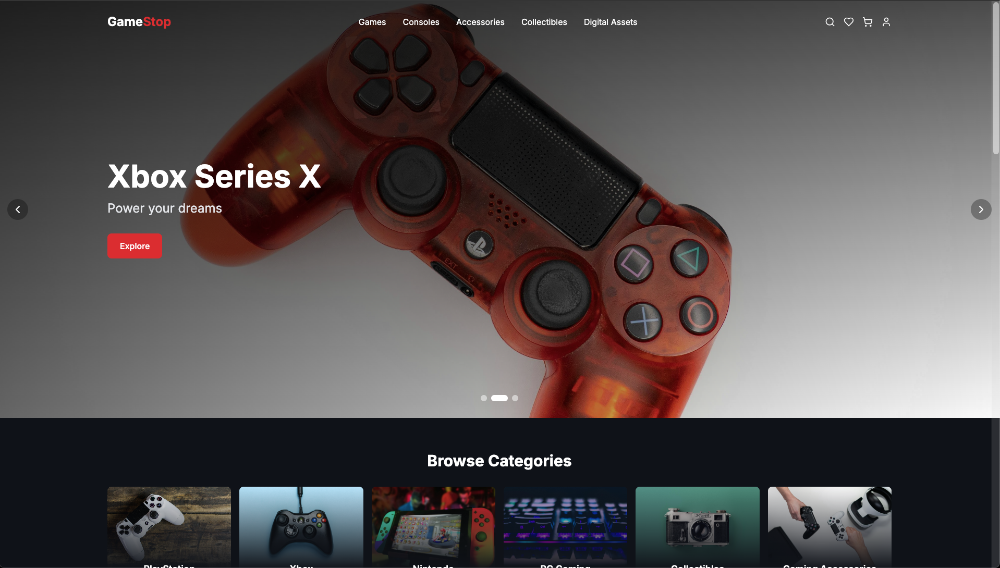

# GameStop Clone

A modern e-commerce platform built with React, TypeScript, and Tailwind CSS, featuring Web3 integration and Stripe payments.



## Features

- 🎮 Modern, responsive gaming e-commerce interface
- 💳 Secure payment processing with Stripe
- 🌐 Web3 wallet integration for digital assets
- 🎯 Dynamic product catalog with categories
- 🔍 Advanced search functionality
- 🛒 Shopping cart with real-time updates
- 💖 Wishlist functionality
- 📱 Mobile-first design approach
- 🌙 Dark mode by default

## Tech Stack

- **Frontend Framework**: React 18 with TypeScript
- **Styling**: Tailwind CSS
- **Icons**: Lucide React
- **Payment Processing**: Stripe
- **Web3**: Custom Web3 integration
- **Deployment**: Netlify
- **Development**: Vite

## Getting Started

1. Clone the repository
2. Install dependencies:
   ```bash
   npm install
   ```
3. Start the development server:
   ```bash
   npm run dev
   ```

## Environment Variables

Create a `.env` file in the root directory with the following variables:

```env
VITE_STRIPE_PUBLIC_KEY=your_stripe_public_key
VITE_SUPABASE_URL=your_supabase_url
VITE_SUPABASE_ANON_KEY=your_supabase_anon_key
```

## Available Scripts

- `npm run dev` - Start development server
- `npm run build` - Build for production
- `npm run preview` - Preview production build
- `npm run lint` - Run ESLint

## Project Structure

```
src/
├── components/         # React components
│   ├── common/        # Shared components
│   ├── home/          # Home page components
│   ├── layout/        # Layout components
│   ├── products/      # Product-related components
│   └── web3/          # Web3 integration components
├── contexts/          # React contexts
├── data/             # Static data and mock content
└── types/            # TypeScript type definitions
```

## Contributing

1. Fork the repository
2. Create your feature branch (`git checkout -b feature/amazing-feature`)
3. Commit your changes (`git commit -m 'Add some amazing feature'`)
4. Push to the branch (`git push origin feature/amazing-feature`)
5. Open a Pull Request

## License

This project is licensed under the MIT License - see the [LICENSE](LICENSE) file for details.

## Acknowledgments

- Design inspired by GameStop's official website
- Icons provided by [Lucide](https://lucide.dev/)
- Stock photos from [Pexels](https://www.pexels.com/)

## Contact

Your Name - [@yourusername](https://twitter.com/yourusername)

Project Link: [https://github.com/yourusername/gamestop-clone](https://github.com/yourusername/gamestop-clone)